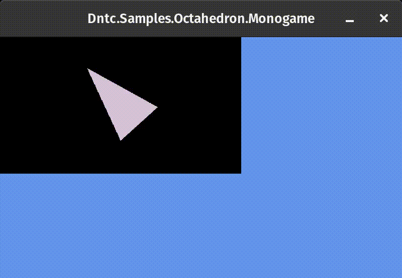
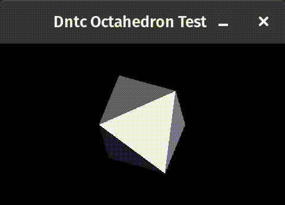
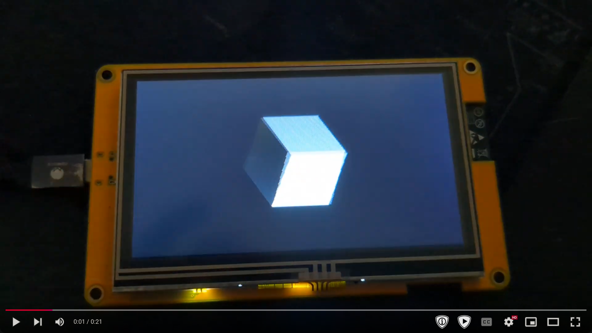

Transpiles compiled .net code to C99 source code and headers. This allows code
originally written in C# (or any language that can compile down to MSIL) to be integrated into
applications built in other languages, or run .net code on systems that do not have a supported
.net runtime.

Since integration into non .net code bases is a core goal, the transpilation process can be
customized on a method by method basis.

<!-- TOC -->
* [Execution](#execution)
  * [File Deletion Warning](#file-deletion-warning)
  * [Method Querying](#method-querying)
* [How It Works](#how-it-works)
  * [Notable Features](#notable-features)
  * [Limitations](#limitations)
  * [Pipeline](#pipeline)
    * [1 - Read All Assemblies](#1---read-all-assemblies)
    * [2 - Form Dependency Graphs](#2---form-dependency-graphs)
    * [3 - Determine Conversion Requirements For Each Dependency](#3---determine-conversion-requirements-for-each-dependency)
    * [4 - Generate an Implementation Plan](#4---generate-an-implementation-plan)
    * [5 - Abstract Syntax Tree Creation](#5---abstract-syntax-tree-creation)
    * [6 - Final Output Generation](#6---final-output-generation)
  * [Transpilation Customization](#transpilation-customization)
    * [Customization Via Attributes](#customization-via-attributes)
      * [CustomDeclarationAttribute](#customdeclarationattribute)
      * [CustomFileNameAttribute](#customfilenameattribute)
      * [CustomFunctionNameAttribute](#customfunctionnameattribute)
      * [InitialGlobalValueAttribute](#initialglobalvalueattribute)
      * [IgnoreInHeaderAttribute](#ignoreinheaderattribute)
      * [NativeFunctionCallAttribute](#nativefunctioncallattribute)
      * [NativeGlobalAttribute](#nativeglobalattribute)
      * [StaticallySizedArrayAttribute](#staticallysizedarrayattribute)
      * [WithCAttributeAttribute](#withcattributeattribute)
    * [Transpiler Plugins](#transpiler-plugins)
  * [Reference Types](#reference-types-)
    * [Create Functions](#create-functions)
    * [Memory Management](#memory-management)
    * [Reference Tracking Limitations](#reference-tracking-limitations)
      * [Returning Reference Types Into C](#returning-reference-types-into-c)
    * [Reference Tracking Limitations](#reference-tracking-limitations-1)
      * [Warning About Structs](#warning-about-structs)
    * [Customization](#customization)
      * [Allocation And Deallocation](#allocation-and-deallocation)
      * [Reference Counting Implementation](#reference-counting-implementation)
  * [DebugInfo](#debuginfo)
* [Samples](#samples)
  * [Linux eBPF Kernel Modules](#linux-ebpf-kernel-modules)
  * [SNES Games](#snes-games)
  * [Octahedron](#octahedron)
    * [SDL Project](#sdl-project)
    * [ESP32S3](#esp32s3)
<!-- TOC -->

# Execution

In order to perform a transpilation, a manifest needs to be created that instructs the transpiler
how to operate. The manifest is a `json` file containing an object with the following fields:

* `DotNetProjectDirectory` - If provided, the .net project in that directory will be built with the
    `dotnet` CLI tool.
* `BuildInDebugMode` - If true and `DotNetProjectDirectory` is specified, the .net project to be built
    is built in debug mode.
* `AssemblyDirectory` - The directory containing assemblies to read for transpiling
* `AssembliesToLoad` - List of all `dll` files to read
* `MethodsToTranspile` - List of all .net methods that should be transpiled. Any methods called by a
    method listed here will also be transpiled, as long as any types and globals used.
  * The methods are specified in their IL id format. See [Method Querying](#method-querying) for
* `OutputDirectory` - Directory to place all generated source and header files.
* `SingleGeneratedSourceFileName` - If specified, no header files will be generated and all types, globals,
    and functions are in a single file with the name provided.

Once a manifest file has been created, the transpiler can be invoked by passing the manifest file as
its argument (e.g. `dntc manifest.json`).

After a successful execution the specified methods and any types, globals, and other methods they depend
on will be transpiled.

## File Deletion Warning

To ensure the output directory only contains the most current and accurate transpilation results,
the whole output directory is deleted. This prevents a method that is no longer being transpiled
from lingering around.

If the transpiler detects any non `.c` or `.h` files in the directory, it will abort the
transpilation process, as it's guaranteed a non-transpilated file would be deleted.

For this reason, it's usually a good practice to have the `OutputDirectory` set to its own
directory, such as `generated/`.

The directory wide deletion does not occur when `SingleGeneratedSourceFileName` is set. Instead,
only that one file is deleted.

## Method Querying

The `MethodsToTranspile` manifest value takes a list of strings where each represents the MSIL
method identifiers. The Ids must match exactly what is seen when the compiled code is inspected.

To get valid values for the methods you are interested in transpiling, the manifest can be created
with the `MethodsToTranspile` value empty. The transpiler can then be invoked with the manifest file
followed by the `query` command (e.g. `dntc manifest.json query`).

This will load all assemblies that were listed in the manifest and print out all method ids it finds.
You can find any root methods you are interested in transpiling and copy/paste them into the manifest.

# How It Works

## Notable Features

* Customization of the transpilation process via attributes
* Easy support for dotnet transpiled code to reference native functions and globals
* Generic method support (as long as concrete type can be determined via static analysis)
* Function pointers passed in from C99 into transpiled methods
  * Represented in C# via `delegate*<T>`
* Arrays being passed in from C99 into transpiled methods.
* Static constructor transpilation with helper functions to allow native code to determine
  when the cost of static constructors are paid.
* Reference type support via reference counting
* Plugin system which allows customizing transpilation details, such as
  * Which native types exist and are used for which .net primitive types
  * Allowing custom attributes to make platform specific transpilations more idiomatic
  * Customizing the memory allocation and deallocation strategy and functions
  * Changing the way some code is transpiled to support non-C99 conforming compilers

## Limitations

While the transpiler is still in development, it has some note-worthy limitations to keep in mind.
The following functionality is not supported:

* Interfaces (outside of generic type parameters)
* Casting between non-primitive value types.
* Most string operations
* Generic functions as a root method for transpilation
  * Any function that takes a generic must have a concrete type for its arguments that can be
    statically guaranteed.
* mscorlib and native types/methods in the .net framework.

Most of these limitations have plans for solving in the future.

## Pipeline

The transpilation process runs as a series of steps run one at a time.

### 1 - Read All Assemblies

All assemblies from the manifest are read. We create a catalog of custom definitions for each
type we find, their methods, and fields.

### 2 - Form Dependency Graphs

For each method to transpile specified in the manifest look at all types and fields the transpiled
method references and add it to a dependency graph. The process is then repeated for each method
the transpiled method invokes.

### 3 - Determine Conversion Requirements For Each Dependency

For each dependency found in the dependency graph, we create a catalog of information of how
each type, method, and field should be transpiled. This includes the name of the header and
source file it will be compiled in, what its name will be in C, etc...

### 4 - Generate an Implementation Plan

Based on the dependency graphs we calculated, we form an implementation plan for what header
files and source files will need to be generated. For each header and source file that is planned
out it figures out which other headers are required to be referenced, what globals are declared
or has implementations, and which methods are declared or implemented.

### 5 - Abstract Syntax Tree Creation

Once we know which types, globals, and methods will go in each header and source file, the transpiler
goes through each file and generates an abstract syntax tree with a non-textual representation of
the transpiled output. Any .net methods that are implemented will have their IL instructions analyzed
and converted into C99 abstract expressions and statements.

The user of ASTs allows the process to be flexible and easily testable.

### 6 - Final Output Generation

Then the ASTs for each output file are taken, and they are converted into actual C99 compilable text.

## Transpilation Customization

To support a wide variety of scenarios, the way .net concepts are transpiled are customized through
the concept of `Definers`,`Definition Mutators`, and `Conversion Mutators`.

A definer takes a Mono.Cecil definition for a field, type, or method and attempts to determine if it can
create a dntc definition based on it. It usually generates a dntc definition based on attributes attached 
to the target. A definer implements the `IDotNetFieldDefiner`, `IDotNetMethodDefiner`, or `IDotNetTypeDefiner`
interfaces and is then added to the `DefinitionGenerationPipeline`. If all definers for a Mono.Cecil definition
fail to return a definition, then a default dntc definition is generated for it.

A definition mutator takes a dntc definition and along with a Mono.Cecil definition to either make 
modifications to the dntc definition or take some other action. For example, a definition mutator exists
to ensure that any method or field that references an enum uses the underlying type of the enum instead
of the enumeration itself. Another example of definition mutators is to update dntc definitions so that
they are compatible with the different type of arrays that are supported (heap vs static). 

These rely on the `IFieldDefinitionMutator` and `IMethodDefinitionMutator` and are added to the 
`DefinerDefinitionPipeline`. These are executed after a definition has been generated for the Mono.Cecil
definition.

A conversion mutator is similar to a definition mutator, except it modifies a `ConversionInfo` instance
instead of a dntc definition. This is used to customize the C name of a field, type, or method, or to
ensure that a type is not included in a header file and only transpiled to source files. 

These are implemented via the `IFieldConversionMutator`, `IMethodConversionMutator`, and 
`ITypeConversionMutator` interfaces, and are added to the `ConversionInfoCreator` class. These mutators
are executed after the `ConversionInfoCreator` generates a `ConversionInfo` instance from a dntc
definition.

### Customization Via Attributes

Several attributes can be used to customize how specific fields, types, and methods are transpiled.

#### CustomDeclarationAttribute

Methods annotated with `[CustomDeclaration]` allows customizing the complete declaration of a function,
including the return type and parameters.

This is useful when a method needs to be transpiled but declared using a macro.

#### CustomFileNameAttribute

Methods, fields and types annotated with `[CustomFileName]` allows changing the name of the header
and source file that the type will be declared and implemented in.

#### CustomFunctionNameAttribute

Methods annotated with `[CustomFunctionName]` allow the method to be named something specific when
transpiled instead of relying on its auto-generated name.

This allows providing a nicer name for functions that need to be called from the integrated C99 code.

#### InitialGlobalValueAttribute

A field annotated with `[InitialGlobalValue("someValue")]` will be transpiled with the raw string argument
set as the initial value of the global field. This is required for setting an initial value, since
providing an initial value in the normal C# method via `=` is done via static constructors, which may
not always be executed as expected on some platforms.

An example of this being useful is for a statically sized array where you want specific default values.

#### IgnoreInHeaderAttribute

Methods, fields, and types annotated with `[IgnoreInHeader]` will only be declared in a source file
and not exist in a header file.

#### NativeFunctionCallAttribute

Annotating a method with the `[NativeFunctionCall]` tells the transpiler that any calls to
the method should be replaced with a function with the provided name. This allows using the .net
method as a stub, and replace it with a function defined in C.

This can be used for transpiled code to call functionality that needs to be specially optimized,
or invoking capabilities that can't be invoked from transpiled code (e.g. `printf()`);

#### NativeGlobalAttribute

Static fields can be annotated with `[NativeGlobal]` to denote that the field itself shouldn't be
transpiled, but instead references to it are replaced with calls to a natively defined global.

This is useful when integrating into a system that has globals defined and they need to be referenced
by the .net code.

#### StaticallySizedArrayAttribute

Fields annotated with `[StaticallySizedArray]` will be transpiled as an array whose size is declared
at compile time, essentially creating a fixed byte array.

#### WithCAttributeAttribute

Methods and fields with the `[WithCAttribute("someAttribute")]` allow the method or field to contain
a specific C attribute after transpilation. This allows for gcc/msvc/ebpf specific attributes in
transpiled code.

### Transpiler Plugins

Different platforms have different requirements for the C code that they generate. For example:
* The SNES C compiler is not fully c99 compliant, and thus can't have '{0}' initializers for global fields.
* Linux eBPF applications require `<vmlinux.h>` and not `<stdlib.h>` for primitive types, and must use
  `__s32` instead of `int32_t` for `int` types

Likewise, users of the transpiler might want custom attributes to make the API more ergonomic for a
specific platform, such as making it easier to declare SNES assembly label references, or Linux
eBPF license declarations.

All of these examples are customizations that are specific to an individual transpilation target and not
general enough to make sense as part of the dntc framework.

These are accomplished by creating implementations of the `ITranspilerPlugin` interface. This interface
allows declaring if the transpiler's native types should be defined (e.g. `int32_t` from `<stdlib.h>`) or
if they should be ignored so they can be swapped out.

Likewise, the transpiler plugin also allows adding custom definers and mutators that are added to the
transpilation pipeline.

Transpiler plugins are specified by `PluginAssembly` value in the manifest. When specified, the transpiler
will automatically pick up `ITranspilerPlugin` implementation in the specified assembly and utilize it.

## Reference Types 

On platforms that support dynamic memory allocation, .net reference types can be used. This includes
inheritance support.

Since .net does not support multiple inheritance, .net reference types are transpiled in a way that
they can be cast to parent types safely using normal casting mechanisms (e.g. `(MyParent*)child`);

Parent fields can be accessed via the `base` field on the struct. Parent types contain function
pointers that can be used to properly access virtual methods that may be overridden.

All .net reference types contain a root inheritance type of `DntcReferenceTypeBase`. This base
reference type contains common fields and function pointers needed for reference counting and
deallocation support.

### Create Functions

Transpiled .net reference types have some extra work that needs to be performed when being created.
Therefore, every transpiled .net reference type has a custom `__Create()` function that allocates
memory for the type, sets up any virtual function pointers that are needed, and set up the 
`PrepForFree()` function pointer. It then returns the created instance (without any reference
count tracking performed).

This means that if native C code wishes to create an instance of a .net reference type, it should always
call the correct `__Create()` method instead of trying to construct it manually.

### Memory Management

Reference types rely on reference counting to know when memory is safe to be reclaimed. When a reference type
### Reference Tracking Limitations

To remain portable, reference types currently utilize a very basic reference tracking system. This
has two main drawbacks:

1. Reference tracking is not thread safe, and decrementing the 
 
instance is stored in a variable (or returned from a function), the C function
`DntcReferenceTypeBase_Gc_Track()` is called to increment the reference count. Every time a .net reference
type is no longer needed, `DntcReferenceTypeBase_Gc_Untrack()` is called to decrement the count. If it 
decrements the reference count to zero, then the memory location of the reference type is deallocated and
the pointer being passed in is `NULL`ed out.

Every transpiled .net reference type contains a `__PrepForFree()` function. This function is used to iterate
through any other reference type the original instance may reference and decrement their reference counts.
This ensures that reference types that contain reference types deallocate properly.

#### Returning Reference Types Into C

When writing native C code that calls a transpiled .net function which returns a .net reference type,
it is important to keep in mind that the instance will have a reference type of at least 1. This
guarantees the instance can be passed into other transpiled functions and not be deallocated unexpectedly.

This means it is up to the non-transpiled C code to call `DntcReferenceTypeBase_Gc_Untrack()` when it is
no longer needed. Forgetting to do so will cause a memory leaks.

Likewise, if native C code creates its own instance of a .net reference type, `DntcReferenceTypeBase_Gc_Track()`
must be called to give it a reference count of 1. If not done, then it is likely passing the instance into
a transpiled function will deallocate it, causing a use after free later on.

### Reference Tracking Limitations

Reference types currently utilize a very basic reference tracking system. This has two main drawbacks:

1. Reference tracking is not thread safe, and calling `Untrack()` from multiple threads for the same
  instance may cause double free and other failures.
2. Cyclic data structures are not allowed.

These may be remedied via the [customization section below](#customization).

#### Warning About Structs

Note that .net structs which contain reference type fields will almost always leak memory, unless
the .net code always `null`s out the field. This is due to value types not being tracked via the
reference counter, and thus will not have `Untrack()` called automatically when it goes out of scope.

### Customization

Memory management has two layers of customization that transpiler plugins may modify:
1. Allocation and deallocation function calls
2. Reference counting implementation

#### Allocation And Deallocation

The transpiler contains the `IMemoryManagementActions` interface which provides the functionality for 
memory allocation and deallocation function calls. Each implementation allows specifying:
1. The headers are required for memory operations
2. The C statements required for allocating memory
3. The C statements required to free previously allocated memory.

The standard memory management scheme uses `calloc()` for allocation and `free()` for deallocation, via
`<stdlib.h>`.

Swapping out the implementation would allow .net reference types to be managed by untraditional or custom
memory allocators (e.g. an arena allocator on systems without dynamic memory).

#### Reference Counting Implementation

The default reference counting system is limited in that it is not thread safe. This is done for maximum
portability. On systems that support threading and locking mechanisms, the reference counting implementation
could be swapped for one that better fits that system and usage pattern.

Customization of the reference counting mechanisms is done by providing a custom implementation of the
`IRefcountImplementation` interface. Implementations must provide an `UpdateCatalog()` method that adds

* Any `CustomDefinedField` implementations for fields that need to be added to the reference type base
  struct.
* A `CustomDefinedMethod` implementation for the `ReferenceTypeConstants.GcTrackMethodId` IL method id,
  which contains the code to increment the reference count for an instance
* A `CustomDefinedMethod` implementation for the `ReferenceTypeConstants.GcUntrackMethodId` IL method id,
  which contains the code to decrement the reference count for an instance (and deallocate the instance
  if the count is low enough).

## DebugInfo

C #Line directives are added to the transpiled code so that the original C# source can be debugged.
This can be controlled via the manifest using the property  "DebugInfoMode".

The default setting (if unspecified) is: "CLineSourceMaps". This generates standard C #Line directives.

Options are:

* `CLineSourceMaps` - This generates standard C #Line directives. This will compress the C statements
  for each line of C# onto a single line.
*  `LineNumberComments` - this will generate a comment that custom tooling can deal with in the format
  `// filename [StartLine:StartColumn] -[EndLine:EndColumn]`
* `None` - turns this feature off, the transpiled C would become the debug source which is helpful
  for debugging the generated code.

# Samples

## Linux eBPF Kernel Modules

A proof of concept utilization of the transpiler to allow writing Linux eBPF kernel modules
in C# can be found in the [DotnetEbpf repository](https://github.com/KallDrexx/DotnetEbpf).

## SNES Games

SNES games written in C# has been shown to be possible via the 
[DotnetSnes framework](https://github.com/KallDrexx/DotnetSnes).

## Octahedron

The [Octahedron samples](Samples/Octahedron) demonstrates a (very basic) software rasterizer written
in C#.  The [render function](Samples/Octahedron/Dntc.Samples.Octahedron.Common/Renderer.cs#L5)
takes in an array RGB565 pixels representing the frame buffer, the camera definition, and how
many seconds have passed since the starting. A list of triangles is retrieved based on which
shape is determined to be drawn, and those are rendered to the frame buffer.

The [Octahedron Monogame project](Samples/Octahedron/Dntc.Samples.Octahedron.Monogame) is a standard
C# project which instantiates a Monogame window, a `Texture2d` surface to render to, and then
passes the frame buffer array into the `Render()` function for drawing. It then takes the array
and renders the pixels in the array to the Texture to display it in the window.

This project is mostly to verify the C# works as expected and does not utilize the transpiler at all.

### SDL Project

The [Octahedron SDL sample](Samples/Octahedron/Octahedron.Sdl) utilizes the transpiler to compile
the sample common project into C code that can be utilized in a standard C SDL project.

The transpilation process uses [its own dntc manifiest](Samples/Octahedron/manifest-sdl.json) to
generate the C code.

### ESP32S3

The [Ocahedron ESP32S3 sample](Samples/Octahedron/Octahedron.Esp32s3) allows running the sample
on an ESP32S3 all-in one board, all without a .net runtime. It uses
[its own dntc manifest](Samples/Octahedron/manifest-esp32.json) to transpile the common project into
standard C code, and then utilizes an standard ESP-IDF main function to initialize the LCD,
initialize a frame buffer array, call the `Render()` function, and display the frame buffer to
the attached parallel LCD.

